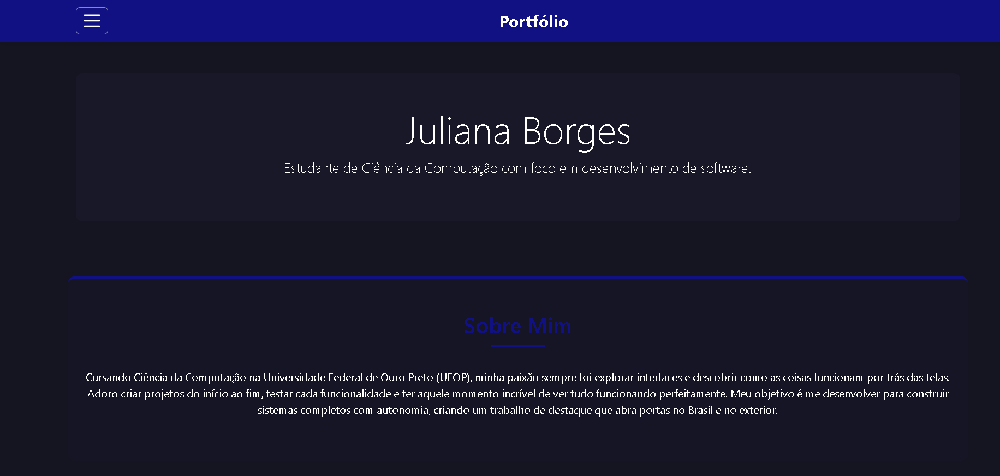

# Portfólio • Juliana Borges

Bem-vindo(a) ao meu portfólio! 🚀  
Aqui você encontra um pouco sobre mim, minhas habilidades, projetos e formas de contato.

## ✨ Sobre o projeto

Este portfólio foi desenvolvido para apresentar minha trajetória, experiências e projetos como estudante de Ciência da Computação. O site é responsivo, com tema escuro, menu lateral moderno e foco em usabilidade.

## 🛠️ Tecnologias

- HTML5
- CSS3
- Bootstrap 5
- Font Awesome

## 📸 Preview



## 📂 Seções

- **Sobre Mim**
- **Habilidades**
- **Projetos**
- **Contato**

## 🚀 Como acessar

Você pode acessar online (se publicado) ou baixar/clonar este repositório e abrir o arquivo `index.html` no navegador.

```bash
git clone https://github.com/julianaapborges/Portfolio.git
cd Portfolio
# Abra o index.html no navegador
```

## 📬 Contato

- [LinkedIn](https://www.linkedin.com/in/juliana-aparecida-borges-138659271)
- [GitHub](https://github.com/julianaapborges)
- julianaaparecidaborges67@gmail.com

---

Feito com 💙 por Juliana Borges
